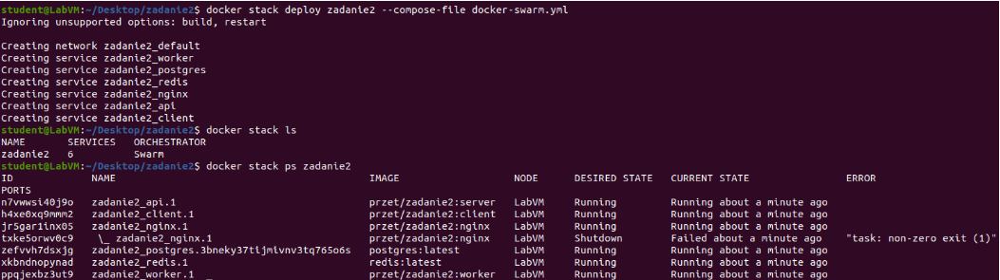

# README - wersja `stack` / `swarm`

## Inicjalizacja klastra

docker swarm init

## Uruchomienie usługi

docker stack deploy zadanie2 --compose-file docker-swarm.yml

## Przyjęte zasady konfiguracji w sekcji `deploy`

Ilość replik każdego z kontenerów jest ustawiana za pomocą jednej zmiennej środowiskowej, w celu uproszczenia konfiguracji.
Kontener `postgres`, ponieważ zawiera bazę danych, nie jest replikowany. Aby był dostępny z każdej kopii każdego kontenera, wykorzystujemy warunek - musi zostać uruchomiony na węźle pełniącym funkcję menadżera.

## Dowód działania usługi

